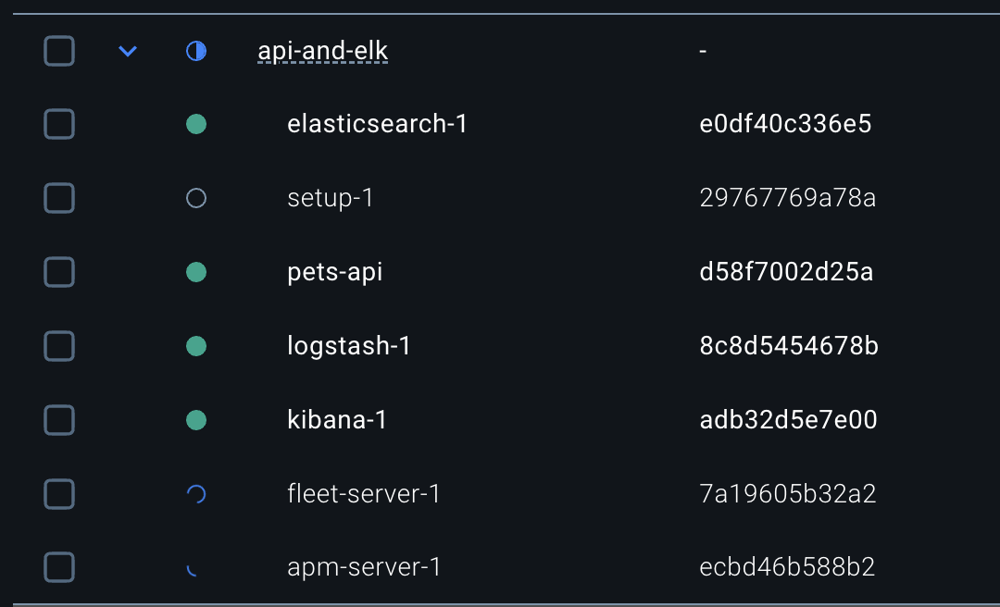
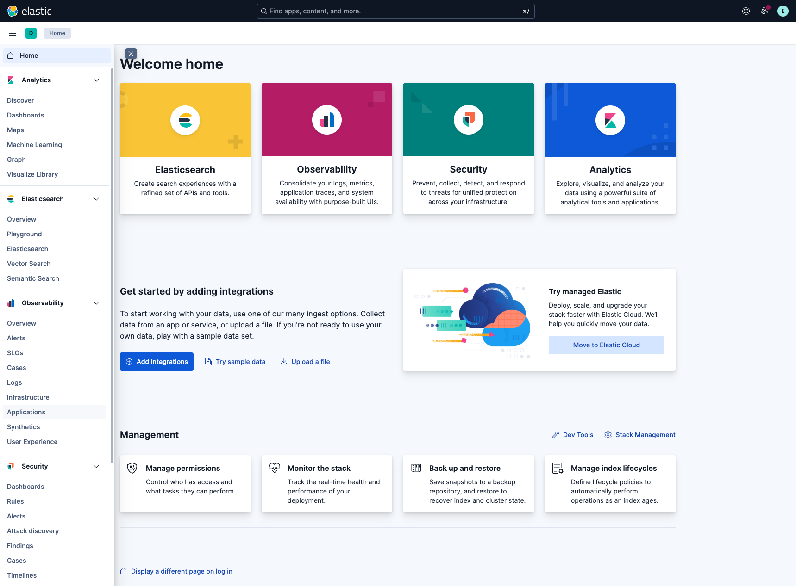
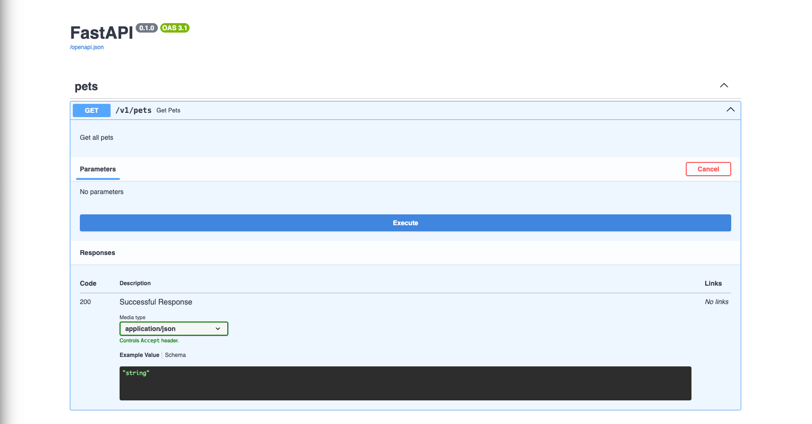

# fastapi-otel-elk

This project contains an ELK stack and a Python FastAPI app that uses OpenTelemetry to for collecting and exporting telemetry data to Elastic APM.

Tools used:

- [docker-elk](https://github.com/deviantony/docker-elk)
- [OpenTelemetry](https://opentelemetry.io/docs/)
- [FastAPI](https://fastapi.tiangolo.com/)

## Requirements

- docker (with docker compose)

## Usage

1. Clone the repo with `git clone --recurse-submodules git@github.com:sandormatyas/fastapi-otel-elk.git`

This way the `docker-elk` submodule will also be pulled. If you did not clone the repo with `--recurse-submodules` you can run the following to fetch the submodule contents:

```sh
git submodule init
git submodule sync
git submodule update
```

2. `docker compose up setup`

The `setup` service in docker-elk needs to be run first. It sets up the necessery requirements for subsequent runs of the entire ELK stack. Once it set everything up it will exit, but the `elasticsearch` container will keep running.

3. `docker compose up`

This runs all services in docker-elk and the "pets-api" found in this repository. Some resources have dependencies on eachother for example `apm-server` requires `fleet-server` which requires `kibana` to be ready, give it a minute or so to see everything ready.

You can easily monitor the service state in docker desktop. After a couple of tries the services will remain in `Running` state.



4. Open http://localhost:5601 in your browser

If everything goes well you will see Kibana's log-in screen. The username and password are sourced from the [.env](.env) file in the root of this repository.

Unless you changed the credentials you can log in with:

    username: elastic
    password: changeme

Open the hamburger menu on the left and go to `Observability` > `Applications`. You will see the API service here as `pets_api_dev`, however, it needs at least 1 transaction to show up.



4. Open http://localhost:8000/docs in your browser

You will find the Swagger UI for the API, where you can easily make calls to endpoints.



Make a call to one of the endpoints and see the service show up in Elastic.

## Exploring logs and traces in ELK

TBD
